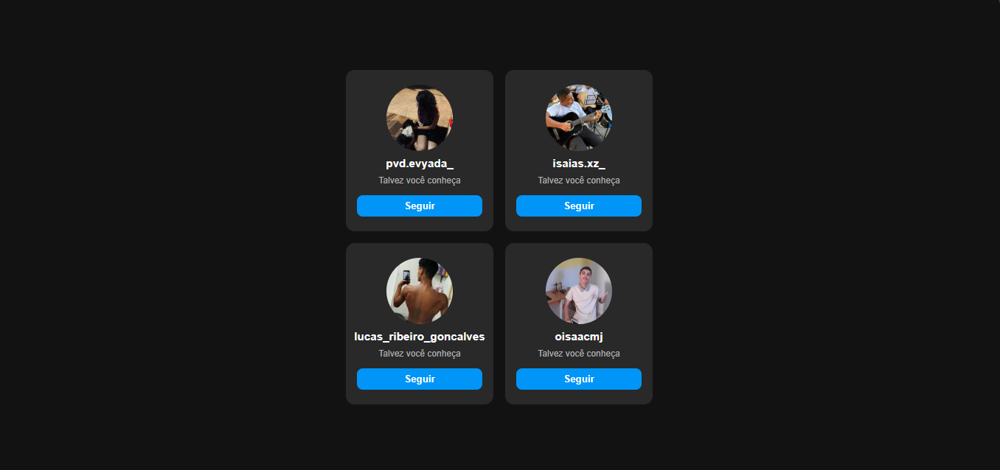

## 📱 Página de Perfis do Instagram

Uma página inspirada na interface de sugestões de perfis do Instagram, desenvolvida com HTML e CSS durante meus estudos em desenvolvimento web.

##📸 Preview

##🛠️ Tecnologias utilizadas
HTML5
CSS3
CSS Grid
Flexbox

##📚 Sobre o projeto

O projeto apresenta uma interface com diferentes perfis organizados em cards, contendo foto, nome de usuário, uma mensagem de sugestão e um botão para acessar cada perfil no Instagram.

A página foi desenvolvida com o objetivo de praticar a criação de layouts, organização de elementos e estilização de interfaces utilizando HTML e CSS.

##🎯 O que pratiquei
Estruturação de páginas com HTML
CSS Grid para organização dos cards
Flexbox para alinhamento dos elementos
Estilização de botões
Utilização de imagens
Links para páginas externas
Efeitos de hover
Organização e espaçamento dos elementos

##🌐 Projeto online

Em breve...

##👨‍💻 Desenvolvido por

Isaias Brito

Estudante de Informática no IFPA e apaixonado por tecnologia e programação.

🔗 GitHub

📸 Instagram

⭐ Este projeto faz parte da minha jornada de aprendizado em programação.
